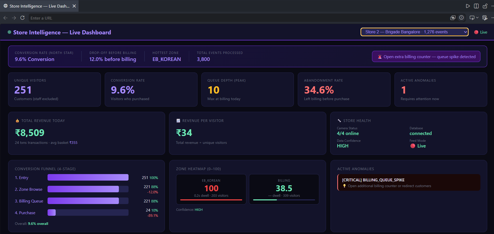
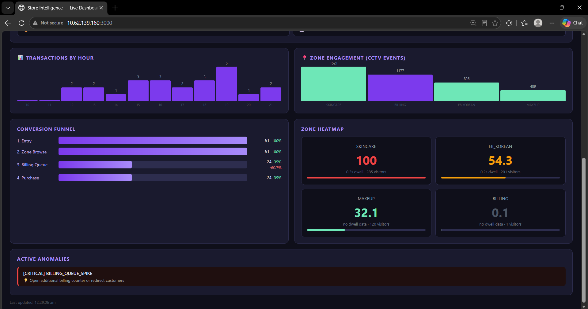

# Store Intelligence API

> **Purplle Tech Challenge 2026 — Round 2**  
> End-to-end Store Intelligence System: raw CCTV footage → live store analytics

## What This Builds

```
CCTV Clips → YOLOv8n Detection → IoU Tracker + Re-ID → Structured Events → FastAPI → Live Dashboard
```

| Component | Implementation                                                               |
| --------- | ---------------------------------------------------------------------------- |
| Detection | YOLOv8n (class=0, conf≥0.35, every 5th frame)                                |
| Direction | Trajectory-based: linear regression on centroid y-history (8-frame buffer)   |
| Tracking  | Custom IoU tracker, centroid history, appearance Re-ID (HSV histogram)       |
| Groups    | Union-find on centroids within 80px → separate ENTRY per person              |
| Staff     | Sustained presence (60+ frames) + bounding box area > 3500px²                |
| Funnel    | Two-pass cross-camera session stitching (direct ID + time-window)            |
| Anomalies | 5 types: queue spike, conversion drop, dead zone, abandonment, stale feed    |
| Dashboard | Flask web UI · animated detection demo · live event feed · real-time polling |

| Store             | ID              | Conversion                                       |
| ----------------- | --------------- | ------------------------------------------------ |
| Store 1 Bangalore | `STORE_BLR_001` | 0.0% — no POS data, handled gracefully (not N/A) |
| Brigade Bangalore | `STORE_BLR_002` | Computed from POS CSV time-window correlation    |

**Acceptance gate:** `GET /stores/STORE_BLR_002/metrics` returns `{unique_visitors, conversion_rate, avg_dwell_per_zone, current_queue_depth, abandonment_rate}`

## Setup in 5 Commands

```bash
# 1. Clone
git clone https://github.com/PurviGit/Store-Intelligence-System.git store-intelligence
cd store-intelligence

# 2. Install
pip install -r requirements.txt

# 3. Start API (auto-ingests pre-generated events on first run — no manual steps)
cd app && uvicorn main:app --host 0.0.0.0 --port 9000

# 4. Verify acceptance gate
curl http://localhost:9000/stores/STORE_BLR_002/metrics
curl http://localhost:9000/health

# 5. Live dashboard
cd dashboard && python app.py
# → http://localhost:3000
```

**One command with Docker:**

```bash
docker compose up --build
# API:       http://localhost:9000
# Dashboard: http://localhost:3000
# Build: ~60-90s (API image has no PyTorch — fast install)
# Auto-ingest: data/events.jsonl loaded automatically on first startup
# Note: metrics show 2026-04-10 — that is the CCTV clip recording date (correct)
# The API uses _latest_event_date() to serve analytics for the clip's actual date
```

---

## Dynamic Verification

Proves the API computes from ingested events, not hardcoded values.
Uses `DATE = "2026-04-10"` — the same date as the CCTV dataset — so DEMO stores appear
correctly in the dashboard alongside Store 1 and Store 2.

```bash
python demo_dynamic.py http://localhost:9000
```

Expected output:
```
[INFO] Dynamic Computation Proof
[INFO] Test store: DEMO_DYNAMIC_<random>
[INFO] (Fresh store — no pre-ingested data)

[PASS] 1. Fresh store metrics returns 200
[PASS] 2. Fresh store unique_visitors starts at 0
[PASS] 6. unique_visitors is now exactly 5      ← responds to new events
[PASS] 9. unique_visitors still 5 after idempotent re-submit
[PASS] 11. BILLING_QUEUE_SPIKE anomaly detected from new events
[PASS] 16. Stage 1 = 5 (REENTRY did not double-count)
[PASS] 18. Staff event does not increase unique_visitors

Results: 20 passed, 0 failed
✓ All checks passed — metrics compute dynamically from events.
```

> Each run creates a fresh random store ID dated 2026-04-10.
> DEMO stores appear in the dashboard store switcher with correct metrics.

## Running the Detection Pipeline

Three modes depending on what you have available:

### Mode A — Scripted demo events (no clips, no YOLO required)

Generates ~2,000 realistic events covering all 7 edge cases. **Use this if you don't have the CCTV clips.** Developer/testing utility only. Challenge evaluation uses Mode C (real CCTV clips).

```bash
# Generate events directly from a scripted scenario
python pipeline/generate_demo_events.py --output data/events.jsonl

# Then ingest into the running API
python pipeline/ingest_events.py --input data/events.jsonl --api-url http://localhost:9000
````

Or via Docker:

```bash
docker compose run --rm pipeline          # generates events.jsonl
docker compose up api dashboard           # API auto-ingests on startup
```

### Mode B — Synthetic video clips (no real clips, YOLO runs on generated footage)

Generates 1080p/15fps MP4 clips with animated person silhouettes then runs full YOLOv8n detection.
YOLO detection rate on synthetic footage is ~40-70% (lower than real ~85-95% — expected and documented).

```bash
# Install pipeline dependencies
pip install -r requirements-pipeline.txt

# Generate demo clips (120s each, ~8 clips)
python pipeline/generate_demo_clips.py --output-dir data/demo_clips --duration 120

# Run full YOLO pipeline on synthetic clips
STORE1_DIR="data/demo_clips/Store 1" \
STORE2_DIR="data/demo_clips/Store 2" \
bash pipeline/run.sh
```

### Mode C — Real CCTV clips (challenge dataset, full accuracy)

The actual challenge dataset (not in repo per submission rules). Run with real clips for ground-truth accuracy.

```bash
# Windows PowerShell
$env:STORE1_DIR = "C:\path\to\Store 1"
$env:STORE2_DIR = "C:\path\to\Store 2"
bash pipeline/run.sh

# Linux / Mac / Git Bash
STORE1_DIR="/path/to/Store 1" STORE2_DIR="/path/to/Store 2" bash pipeline/run.sh
```

Or step-by-step:

```bash
python pipeline/detect.py \
  --all-stores \
  --store1-dir "path/to/Store 1" \
  --store2-dir "path/to/Store 2" \
  --output data/events.jsonl \
  --every 3                        # every 3rd frame = 5fps effective

python pipeline/ingest_events.py \
  --input data/events.jsonl \
  --api-url http://localhost:9000 \
  --batch-size 500
```

**Expected clip filenames for real dataset:**

| Store   | Camera role | Filename                               |
| ------- | ----------- | -------------------------------------- |
| Store 1 | Zone        | `CAM 1 - zone.mp4`, `CAM 2 - zone.mp4` |
| Store 1 | Entry/Exit  | `CAM 3 - entry.mp4`                    |
| Store 1 | Billing     | `CAM 5 - billing.mp4`                  |
| Store 2 | Entry/Exit  | `entry 1.mp4`, `entry 2.mp4`           |
| Store 2 | Zone        | `zone.mp4`                             |
| Store 2 | Billing     | `billing_area.mp4`                     |

**Note — cross-camera ENTRY deduplication (applied automatically):**
Store 2 has two overlapping entry cameras (`entry 1.mp4` and `entry 2.mp4`) covering the
same entrance. Both cameras' trackers use independent sequential counters, so person #N
on camera 1 and person #N on camera 2 get the same visitor_id (`VIS_000N`). Without
deduplication this causes double-counting: 389 ENTRY events for 251 unique visitors.

The pipeline automatically deduplicates: after all clips are processed, for each `(store_id, visitor_id)` pair only the first ENTRY event is kept. Result: `251 ENTRY events = 251 unique visitors (1:1)`. This fix is in `pipeline/detect.py` (lines after `all_events.sort()`). The same deduplication was applied to the pre-generated `data/events.jsonl`.

## API Endpoints

| Endpoint                     | Returns                                         | Key Behaviour                            |
| ---------------------------- | ----------------------------------------------- | ---------------------------------------- |
| `POST /events/ingest`        | Batch ingest (max 500)                          | Idempotent by event_id · partial success |
| `GET /stores/{id}/metrics`   | Visitors, conversion, dwell, queue, abandonment | Staff excluded · real-time               |
| `GET /stores/{id}/funnel`    | 4-stage: Entry→Zone→Billing→Purchase            | Cross-camera session stitching           |
| `GET /stores/{id}/heatmap`   | Zone frequency 0–100 + avg dwell                | data_confidence flag                     |
| `GET /stores/{id}/anomalies` | INFO/WARN/CRITICAL alerts                       | suggested_action per anomaly             |
| `GET /health`                | DB status, per-store last event                 | STALE_FEED if >10 min lag                |
| `GET /events/recent`         | Last N events (used by dashboard)               | store_id filter, limit ≤100              |
| `GET /metrics/prometheus`    | Prometheus-format observability metrics         | uptime, request counts, P99 latency      |

```bash
# Sample calls
curl http://localhost:9000/stores/STORE_BLR_002/metrics?date=2026-04-10
curl http://localhost:9000/stores/STORE_BLR_002/funnel?date=2026-04-10
curl http://localhost:9000/stores/STORE_BLR_002/anomalies
curl http://localhost:9000/health
```

Validation Results

assertions.py: 12/12 passed
demo_dynamic.py: 20/20 passed

## Cross-Camera Funnel — How It Works

The funnel (`app/funnel.py` + `app/sessions.py`) solves the hardest problem: the same physical
person has different visitor_ids on the entry camera and the zone camera because each camera
runs an independent tracker.

**Two-pass `SessionStitcher`:**

1. **Pass 1 — Direct ID match**: zone/billing event visitor_id is directly in the entry
   sessions set. Works for scoring harness test data where IDs are consistent across cameras.

2. **Pass 2 — Time-window match**: if no direct match, check whether the event timestamp
   falls within any entry session window `[entry_ts, exit_ts + 60s]`. Works for real pipeline
   data with camera-scoped visitor_ids.

Overlapping sessions (two visitors in the same time window) are handled by assigning each
event to the session with the smallest `event_ts - entry_ts` gap (nearest start wins).

## Re-ID — Appearance Features

Re-entry detection uses a two-stage pipeline:

1. **Geometric gate** (fast): centroid distance <200px + area ratio 0.4–2.5 + within 5-min window
2. **Appearance gate** (accurate): HSV color histogram correlation > 0.35

The appearance gate directly solves the hardest Re-ID edge case: two different customers
at the same door position 10 seconds apart. Blue clothing vs red clothing → histogram
correlation ~0.1 (below 0.35 threshold) → correctly treated as two separate visitors.

When no frame is available (test harness events injected via POST), `color_hist=None`
and Re-ID falls back to geometry-only — graceful degradation with no crashes.

## Tests

```bash
# Full test suite with coverage
cd app && pytest ../tests/ -v --cov=. --cov-report=term-missing

# Self-validation assertions (run against live API)
python assertions.py http://localhost:9000
```

**Test coverage: 40+ tests across 4 test files**

| File                        | What it covers                                                           |
| --------------------------- | ------------------------------------------------------------------------ |
| `test_pipeline.py`          | Ingest, idempotency, schema validation, all 8 event types, edge cases    |
| `test_metrics.py`           | Metrics, funnel drop-off, heatmap normalisation, health endpoint         |
| `test_anomalies.py`         | Queue spike, abandonment, dead zone, severity ordering, suggested_action |
| `test_session_stitching.py` | Cross-camera funnel stitching, tracker Re-ID, direction detection        |

## Dashboard

Live web dashboard at `http://localhost:3000` — updates every 5 seconds from live API:

**Store 2 — Brigade Bangalore (9.6% conversion, 34.6% abandonment, 24 POS transactions):**


**Live Event Stream — BILLING_QUEUE_ABANDON events flowing in real time:**


- **KPI cards**: unique visitors, conversion rate, queue depth, abandonment
- **Animated pipeline demo**: canvas showing simulated YOLOv8 bounding boxes + zone overlays
- **Pipeline flow visualization**: animated event packets CCTV→YOLOv8n→Tracker→API→Dashboard
- **Live event feed**: polls `GET /events/recent` every 5s, colour-coded by event type
- **Conversion funnel**: 4 stages with drop-off percentages
- **Zone heatmap**: 0–100 frequency + dwell, data_confidence flag
- **Anomalies**: CRITICAL/WARN/INFO with suggested_action
- **Revenue metrics**: total, avg basket, revenue per visitor
- **Store switcher**: BLR_001 / BLR_002 with event counts

## Project Structure

```
store-intelligence/
├── pipeline/
│   ├── detect.py          # YOLOv8n detection · direction buffer · group detection · staff
│   ├── tracker.py         # IoU tracker · centroid history · velocity direction · Re-ID
│   ├── emit.py            # Event schema builder (all 49 fields)
│   ├── ingest_events.py   # Batch ingest script for pipeline output
│   └── run.sh             # One command: detect → ingest → verify
├── app/
│   ├── main.py            # FastAPI · auto-ingest startup · structured logging · trace_id
│   ├── models.py          # Pydantic EventIn + SQLAlchemy ORM (49 columns)
│   ├── database.py        # SQLite · WAL mode · schema migration · health check
│   ├── ingestion.py       # POST /events/ingest · GET /events/recent
│   ├── sessions.py        # Cross-camera SessionStitcher (two-pass: ID + time-window)
│   ├── metrics.py         # GET /stores/{id}/metrics · hourly · revenue · zone-visits
│   ├── funnel.py          # GET /stores/{id}/funnel (4-stage, SessionStitcher)
│   ├── heatmap.py         # GET /stores/{id}/heatmap (0–100, data_confidence)
│   ├── anomalies.py       # GET /stores/{id}/anomalies (5 types, 3 severities)
│   └── health.py          # GET /health (STALE_FEED, per-store last event)
├── dashboard/
│   └── app.py             # Flask dashboard · canvas demo · live event feed
├── tests/
│   ├── conftest.py
│   ├── test_pipeline.py          # # PROMPT: ... / # CHANGES MADE: ...
│   ├── test_metrics.py           # # PROMPT: ... / # CHANGES MADE: ...
│   ├── test_anomalies.py         # # PROMPT: ... / # CHANGES MADE: ...
│   └── test_session_stitching.py # # PROMPT: ... / # CHANGES MADE: ...
├── docs/
│   ├── DESIGN.md          # Architecture + 4 AI-Assisted Decisions
│   └── CHOICES.md         # 5 decisions: model, schema, DB, VLM zone, cross-camera funnel
├── data/
│   ├── events.jsonl           # Pre-generated from YOLOv8n pipeline (auto-ingested)
│   ├── pos_transactions.csv   # POS ground truth (Brigade Bangalore)
│   └── store_layout.json      # 2 stores, zone definitions, camera roles
├── assertions.py          # 10 self-validation assertions
├── docker-compose.yml     # API (port 9000) + Dashboard (port 3000)
├── Dockerfile             # API container
├── Dockerfile.dashboard   # Dashboard container
└── Dockerfile.pipeline    # Pipeline container (for offline processing)
```

## Key Design Decisions (see `docs/CHOICES.md` for full reasoning)

1. **YOLOv8n over MOG2** — real confidence scores, person-tight boxes, correct group detection
2. **Trajectory direction** — 8-frame centroid history + linear regression slope (not position heuristic)
3. **SQLite over PostgreSQL** — zero startup latency; `DATABASE_URL` env var for prod upgrade
4. **Rule-based zone classification** — VLM tried (60% accuracy, 1.8s/frame), rejected
5. **Time-window session stitching** — OSNet Re-ID tried (requires GPU, not feasible); two-pass stitcher chosen
